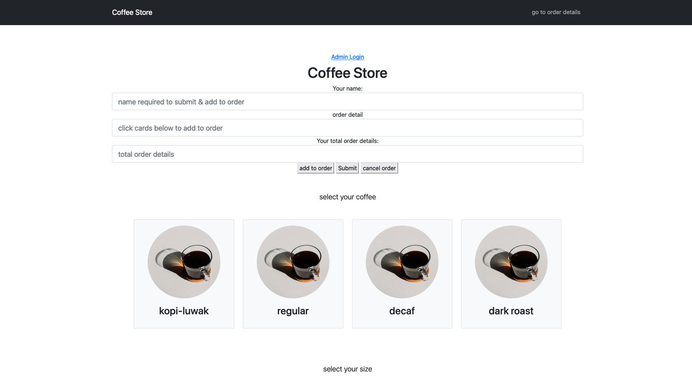
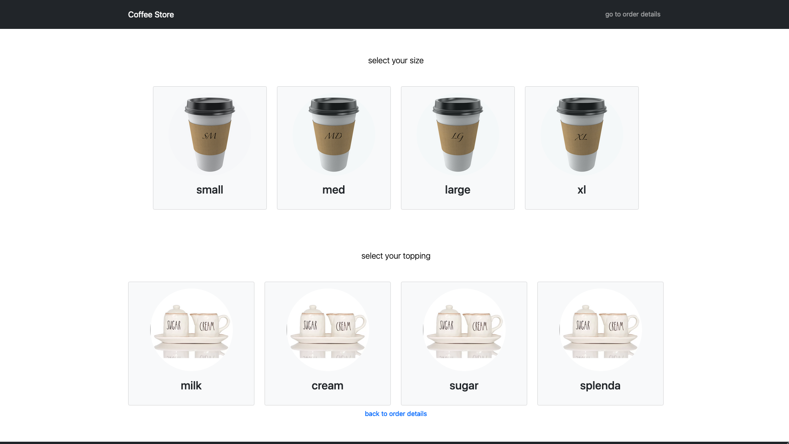
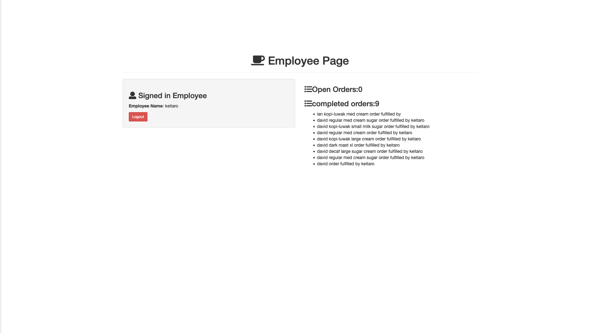

# My Awesome Project
This project is for creating a Point of sales system for a Coffee Store. you have a build to order menu for making your own coffee beverage order! after selecting the brew, size, and toppings, you can add to the order or submit the order!
The order then gets processed server side to be made available to an administrator ( the barista) who can fulfill orders in a que and have the signed on baristas name attached to the fulfilled order!

**Link to project:**
https://barista-pos-system.herokuapp.com/

## How It's Made:

**Tech used:** HTML, CSS, JavaScript, Express, Node.js, Boostrap, Passport, Mongoose, EJS 

Full CRUD functional application:

READ - after signing in the get request reads and renders our feed view using EJS as our view engine. It provides the entire database collection of image posts to the response object and renders our feed page view onto the DOM.

when clicking on the profile page link the get request reads and renders our profile view using EJS as our view engine. what is rendered onto the page is filtered to only include the submissions of the current session.

when clicking on a users name, you will be redirected to the page view. what is rendered onto the page are images filtered to only include the submissions of the users name who was clicked.

when clicking on an image, the post view is rendered. The post view shows the single image that was clicked and any comments posted by other app members.

POST - the post request will save the user input into a database and trigger another get request to render a new page with the updated information.

PUT - The put request will run when the heart icon is clicked. Event listeners trigger a function that submit a fetch request to our declared routes for put requests. The routes use mongo provided functions findOne and update to modify the dom and returns a response to our function in the main.js folder. The promise in our fetch triggers a page reload.

DELETE - the delete request deletes a user from our database.

## Optimizations

## Lessons Learned:

- using an array to collect information when an event is triggered on the dom. having that information placed in a form that can be submitted for server side processing.

-when rendering pages, grabbing specific things in a collection to send to be rendered by ejs by filtering using mongoose function find and entering unique identifiers as the argument.

-using  placeholders and req.params to store values on the req.params object.

- using multer as a dependency to allow users to upload images to the server. Images are stored on the server, while the file path to that image is stored as a string in the database.

## Examples:

